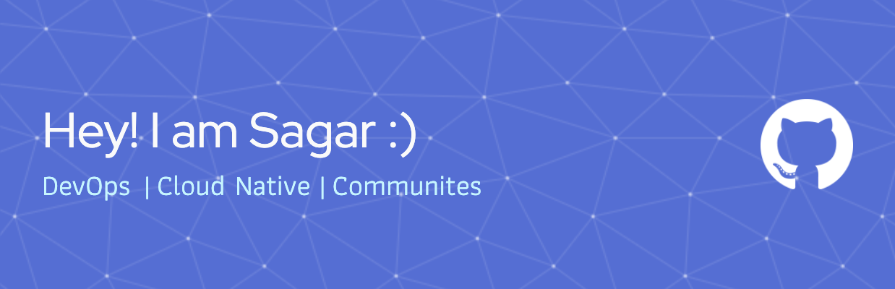
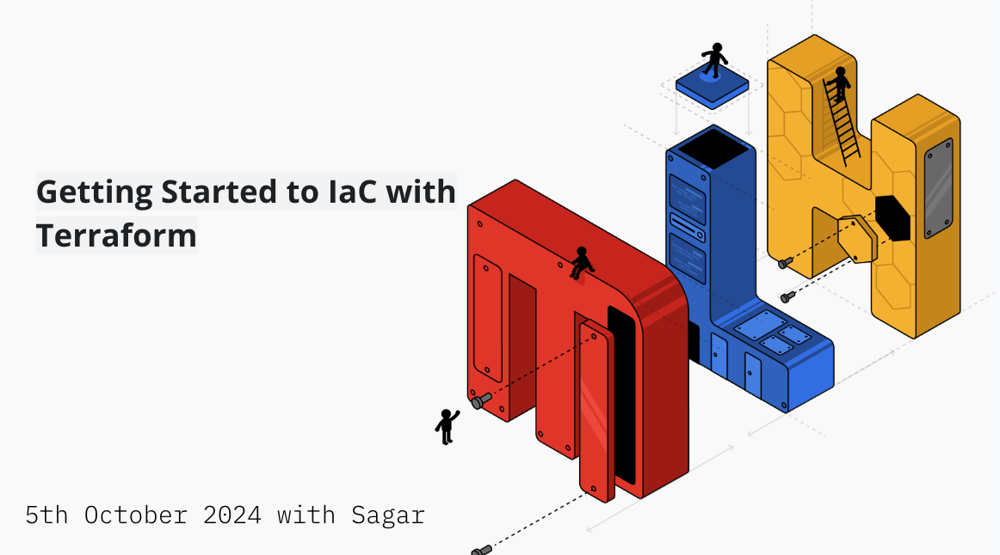

<h2> 🤘 About me </h2>

<ul>
<li> 👤 Name: Sagar Uprety </li>
<li> 😄 Pronouns: He/Him </li>
<li> 📌 Location : Munich, Germany 🇩🇪 </li>
<li> 📢 Languages: English, Nepali
<li> 🎓 MSc. Information Systems at Technical University of Munich | Tech Evangelist | AWS Solutions Architect </li>
<li> ❤️ I love DevOps, Cloud Computing and Automation </li>
</ul>

--- 
<h2 > 👨‍💻 I'm currently ...</h2>

- 🔭 Building DevOps Solutions
- 🧑‍💻 Looking for part-time opportunities in DevOps/Cloud roles
- 🥳 Empowering student hackers and organizers around the globe as a Coach at [Major League Hacking (MLH)](https://mlh.io/)
- 🎗️ Supporting students to build diverse and inclusive community as a [GitHub Campus Expert](https://education.github.com/experts)
- 🍗 Building secret recipes for Chicken Wings on weekends!

---

<h2 > 🎥 YouTube videos </h2>

<table>
<!-- YOUTUBE-VIDEOS-LIST:START -->
<tr><td></td>
<td><a href="https://www.youtube.com/watch?v=jCJAiOSuOkg">Learn Docker Bridge Network in 15 Minutes
</a>  </td></tr>
<tr><td></td>
<td><a href="https://www.youtube.com/watch?v=EKCs25wL_Vg">Learn Docker Volumes in 20 Minutes | Docker Storage
</a>  </td></tr>
<tr><td></td>
<td><a href="https://www.youtube.com/watch?v=PoL1lDrZ6hE&list=PLLrYSkpcHmySGiEeS5tDsIUDW8zG6myBa">Deploy your web application with Azure App Service & GitHub Actions</a> (Cloud Summit 2021) </td></tr>
<tr><td></td>
<td><a href="https://www.youtube.com/watch?v=fG5BL7Uisag">Getting started to IaC with Terraform</a>(MLH) </td></tr>
<!-- YOUTUBE-VIDEOS-LIST:END -->
</table>

---

<h2>🖥️ Tech Stack and Tools Used</h2>

<table>
<tr>
    <td align="center"  width="96" height="40">
        
     JavaScript
    </td>
    <td align="center"  width="96"height="40" >
            
     Python
    </td>
    <td align="center"  width="96" height="40">
            
     C++
    </td>
    </td>
    <td align="center" width="96" height="40">
            
     MySQL
    </td>
    <td align="center" width="96" height="40">
            
     mongoDB
    </td>
    <td align="center" width="96" height="40">
            
     nodejs
    </td>
    </td>
    <td align="center"  width="96" height="40">
            
     Git
    <td align="center"  width="96" height="40">
            
     GitHub
    </td>
    <td align="center"  width="96" height="40">
            
     Figma
    </td>
    
</tr>
<tr>
    <td align="center" width="96" height="40">
            
     Docker
    </td>
    <td align="center" width="96" height="40">
            
     Kubernets
    </td>
    <td align="center" width="96" height="40">
            
     Terraform
    </td>
    <td align="center" width="96" height="40">
            
     Prometheus
    </td>
    <td align="center" width="96" height="40">
            
     Ansible
    </td>
    <td align="center" width="96" height="40">
            
     Linux
    </td>
    <td align="center" width="96" height="40">
            
     Azure
    </td>
      <td align="center" width="96" height="40">
            
     AWS
    </td>
      <td align="center" width="96" height="40">
            
     Linode
    </td>
    <td align="center" width="96" height="40">
            
     VsCode
    </td>
</table>

---

<h2 >  💬 Want To Contact Me? </h2>

Feel free to reach out to me for anything, I'll be happy to connect with you all!

  
   
  

